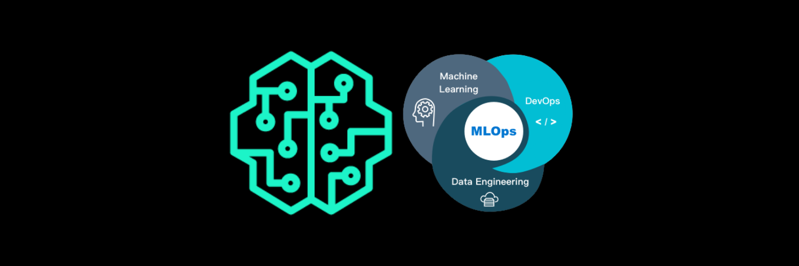

# SageMaker MLOps

<!-- PROJECT LOGO -->
<br />
<p align="center">
  <a href="https://github.com/dao-duc-tung/sagemaker-mlops">
    
  </a>

  <h3 align="center">SageMaker MLOps</h3>
</p>

<!-- TABLE OF CONTENTS -->
<details open="open">
  <summary>Table of Contents</summary>
  <ol>
    <li><a href="#introduction">Introduction</a></li>
    <li><a href="#architecture">Architecture</a></li>
    <li><a href="#customize-docker-images">Customize Docker images</a></li>
    <li><a href="#setup-sage-maker-studio-project">Setup SageMaker Studio project</a></li>
    <li><a href="#cleanup">Cleanup</a></li>
    <li><a href="#faq">FAQ</a></li>
    <li><a href="#license">License</a></li>
    <li><a href="#contact">Contact</a></li>
  </ol>
</details>

## Introduction

The system customizes the [AWS safe deployment pipeline for SM](https://github.com/aws-samples/amazon-sagemaker-safe-deployment-pipeline). This solution provides a _Blue/Green_, also known as a _Canary_ deployment, by creating a Lambda endpoint that calls into a SageMaker endpoint for real-time inference.

### Abbreviation and Terminology

1. **SM**: SageMaker
1. **LD**: Lambda
1. **CF**: CloudFormation
1. **CW**: CloudWatch
1. **SF**: A State machine that is responsible for managing the training pipeline using AWS Step Functions
1. **EFS**: Elastic File System
1. **SM endpoint**: Model endpoint created by SageMaker, only can be used from an LD function
1. **LD endpoint**: A LD function that is responsible for serving prediction service by calling SM endpoint
1. **API endpoint**: API Gateway endpoint that links with the LD endpoint. This endpoint is public and is called by the end application (ie. mobile app, web app, etc.)
1. **Dev deployment**: Deployment in the development stage
1. **Prod deployment**: Deployment in the production stage
1. **System pipeline**: A CodePipeline that has several steps including fetching source code, building CF stacks, running SF, dev deployment, and prod deployment

### System functionalities

The system supports the following functionalities:

- **Training**
  - Training data is saved in an S3 bucket
  - Customizable docker image for pre-processing data, training model, and model evaluation
- **Deployment**
  - Customizable docker image for serving model at SM endpoint
  - Support multi-core serving at SM endpoint instance using Nginx and Gunicorn
  - 2-stage deployment: dev and prod
  - Manual approval to deploy model from dev to prod stage
  - Customizable docker image for serving prediction service at LD endpoint
  - LD endpoint links with EFS shared volumes to store user data
- **Monitoring**
  - Capture request data and response data of SM endpoint
  - Detect feature drift and alert
  - CloudWatch dashboard to monitor system metrics
  - Send alarm to admin email
- **Automation**
  - Auto rerun system pipeline monthly
  - Upload data to S3 bucket -> auto rerun system pipeline
  - Source code updated -> auto rerun system pipeline
  - Feature drift detected -> auto rerun system pipeline
  - Auto-scaling SM endpoint
  - Auto shifting traffic from the old LD endpoint to the new LD endpoint
  - Canary deployment strategy with rollback on error

## Architecture

The architecture diagram below shows the entire MLOps pipeline at a high level. This pipeline uses the CF template `pipeline.yml` to build.

![architecture][architecture]

### Component Details

- **Key Management Service (KMS)**: encrypts data and artifacts.
- **Secrets Manager**: stores your GitHub Access Token.
- **Simple Notification Service (SNS)**: notifies you when CodeDeploy has successfully deployed the API, and to receive alerts for retraining and drift detection (signing up for these notifications is optional).
- **Two Amazon CloudWatch event rules**: one which schedules the pipeline to run every month, and one which triggers the pipeline to run when SageMaker Model Monitor detects certain metrics.
- **SageMaker Jupyter notebook**: to develop.
- **S3**: stores model artifacts.
- **CodePipeline**: defines several stages.

### Folder structure

```bash
.
├── api
│   ├── __init__.py
│   ├── app.py
│   ├── post_traffic_hook.py
│   └── pre_traffic_hook.py
├── assets
│   ├── deploy-model-dev.yml
│   ├── deploy-model-prd.yml
│   ├── suggest-baseline.yml
│   └── training-job.yml
├── container
│   ├── Dockerfile
│   ├── Dockerfile.lambda.ecr
│   ├── build_image.sh
│   ├── push_image.sh
│   └── code
│       ├── evaluate.py
│       ├── lambda_handler.py
│       ├── nginx.conf
│       ├── predictor.py
│       ├── prepare_data.py
│       ├── requirements.txt
│       ├── serve
│       ├── train
│       ├── utils.py
│       └── wsgi.py
├── custom_resource
│   ├── __init__.py
│   ├── sagemaker-custom-resource.yml
│   ├── sagemaker_add_transform_header.py
│   ├── sagemaker_create_experiment.py
│   ├── sagemaker_query_drift.py
│   ├── sagemaker_query_evaluation.py
│   ├── sagemaker_query_training.py
│   ├── sagemaker_suggest_baseline.py
│   └── sagemaker_training_job.py
├── exp_nbs
│   ├── exp-local-sm.ipynb
│   ├── exp-ml-gateway.ipynb
│   ├── exp-real-sm.ipynb
│   └── exp-step-functions.ipynb
├── model
│   ├── buildspec.yml
│   ├── requirements.txt
│   └── run_pipeline.py
├── scripts
│   ├── build.sh
│   ├── lint.sh
│   ├── rm_prj.sh
│   ├── rm_s3.sh
│   └── validate-tpl.sh
├── pipeline.yml
├── studio.yml
└── studio_nbs
    ├── dashboard.json
    └── mlops.ipynb
```

## Customize Docker images

This step creates several python scripts for steps including preparing data, training model, evaluating model, and serving model. This step is done in an SM notebook instance.

The input of this step is the training code, evaluation code, and the model serving code of an ML model. The output of this step is the two docker images that contain all of these scripts.

The 1st docker image serves as a multi-functional docker image for preparing data, training model, evaluating model, and serving model. Combining all of these scripts simplifies the development process without creating several docker images for each script which is overkilled for this sample solution. Check [this tutorial](https://sagemaker-workshop.com/custom/containers.html) for more details.

The 2nd docker image serves as the runtime environment for the LD endpoint. This docker image uses the 1st docker image as the base image. The reason why we cannot use the 1st docker image directly for the LD endpoint is that the container-based LD function requires an additional library called `awslambdaric`. This LD function also requires a specific entry point and a specific command to run. Check [this article](https://docs.aws.amazon.com/lambda/latest/dg/images-create.html#images-create-from-alt) for more details.
Let's start by creating an SM notebook instance and clone this repository to the notebook environment.

### Develop locally

The local environment here means the local SM notebook instance. Open `exp_nbs/exp-local-sm.ipynb` and run through the notebook. You might need to modify the scripts in the `container/code` folder.

The reason why we need to develop in the local environment first is to debug faster because running the SM processing job and SM training job takes a lot of time.

### Deploy to SM endpoint

Open `exp_nbs/exp-real-sm.ipynb` and run through the notebook. You might need to modify the scripts in the `container/code` folder. This step runs similar code to the previous step.

This notebook already included the code for testing the SM endpoint.

### Deploy to LD endpoint

Open `exp_nbs/exp-ml-gateway.ipynb` and run through the notebook. You might need to modify the script `container/code/lambda_handler.py`. This step runs similar code to the previous step.

This notebook already included the code for testing the LD endpoint and the API endpoint.

### Develop SF

Open `exp_nbs/exp-step-functions.ipynb` and run through the notebook.

## Setup SageMaker Studio project

This step deploys the ML model to the production environment. We use the SM Studio project as the development environment.

The input of this step is the output of the previous step which is the docker images. The output of this step is the API endpoint consumed by the end application.

### Deploy SM Studio Organization template

1. Prepare your LINUX environment
   - Install `rsync`, `zip`.
   - Install `aws-cli` in your python environment.
   - Clone this repo to your LINUX system.
1. Update the `studio.yml` and `pipeline.yml` if needed
   - `studio.yml` creates the SM Studio organization template and the required resources.
   - `pipeline.yml` creates the required resources for the SM Studio project when you create a new SM Studio project.
1. Validate the CF templates by running
   ```bash
   bash scripts/validate-tpl.sh
   ```
1. Build the SM Studio Organization template.

   ```bash
   bash scripts/build.sh <S3_BUCKET_NAME> <STACK_NAME> <REGION> <STUDIO_ROLE_NAME>

   # Example:
   # bash scripts/build.sh sagemaker-safe-deployment-tpl sagemaker-safe-deployment-tpl ap-southeast-1 AmazonSageMaker-ExecutionRole-20211022T094935
   ```

   - **S3_BUCKET_NAME**: sagemaker-safe-deployment-tpl. This bucket stores the organization template artifacts.
   - **STACK_NAME**: sagemaker-safe-deployment-tpl. This is the CF stack name that creates this SM Studio organization template.
   - **REGION**: ap-southeast-1. This is your working AWS region.
   - **STUDIO_ROLE_NAME**: AmazonSageMaker-ExecutionRole-20211022T094935. This is the SM Execution Role.

In case this step is failed, run the following command to remove the created S3 bucket or remove the created project

```bash
bash scripts/rm_s3.sh sagemaker-safe-deployment-tpl ap-southeast-1
bash scripts/rm_prj.sh <studio-project-name>
```

### Create SM Studio project

1. Open SM Studio, create a new SM Studio project using the Organization template named SageMaker Safe Deployment template with the following information. This step will create a CF stack named `SC-<account id>-pp-<...>` using `pipeline.yml` template.

   - Name (16 chars): `sd-test-01`
   - Description: `Safe deployment pipeline`
   - Model name (10 chars): `sd-test`
   - S3 Bucket for Dataset: `prod-test`
   - Unique prefix to bind the components (10 chars): smsd. This prefix MUST be the same as `PREFIX` in `scripts/build.sh`
   - Git Branch: `main`
   - Email: `example@example.com`
   - Train and build timeout: `45`

1. Clone this repository to the created Studio project

### Run the system pipeline

#### System pipeline overview

The system pipeline consists of several stages.

1. **Source stage**. When a new commit is pushed to the main branch or `data-source.zip` is uploaded to the pre-defined S3 folder, the system pipeline will be triggered.

1. **Build stage**. This stage consists of two steps. Check `pipeline.yml` for more detail.

   1. Step 1: Build templates. This step runs `model/buildspec.yml` to update several CF templates and generate their parameters including:

      - `custom_resource/sagemaker-custom-resource.yml`: This CF stack creates the required LD resources.
      - `workflow-graph.yml`: this CF stack creates the SF to train the model. It is auto-generated using python (check `model/run_pipeline.py` file).
      - `assets/deploy-model-dev.yml`: This CF stack creates the SM endpoint in dev deployment.
      - `assets/deploy-model-prd.yml`: This CF stack creates some resources in prod deployment such as SM endpoint, LD endpoint, API endpoint, Auto Scaling policy, Model Monitoring Schedule, and CW alarms.

   1. Step 2: This step updates the `sagemaker-custom-resource.yml` stack and the `workflow-graph.yml` stack.

1. **Train stage**. This stage will run the SF to:

   - Create a _baseline_ for the model monitor using an SM processing job
   - Train a model using an SM training job
   - Save the trained model
   - Query the evaluation results using the query-evaluation LD function created by `sagemaker-custom-resource.yml` CF stack
   - Verify if the evaluation results meet the requirements
   - Query the training results using the query-training LD function created by `sagemaker-custom-resource.yml` CF stack to do some post-processes such as copying training job artifacts that need for inference to the EFS shared data volume. This LD function MUST implement the `Retry step function block` because mounting the EFS takes time and might cause a timeout error.

1. **Dev deployment stage**. This stage creates the `deploy-model-dev.yml` CF stack. After the SM endpoint is deployed, this stage will wait for you to manually approve the changes to move to the next stage.

1. **Prod deployment stage**. This stage creates the `deploy-model-prd.yml` CF stack.

#### Update system pipeline

Update and run `studio_nbs/mlops.ipynb` to initiate the system pipeline and its resources. You can run through this notebook to see how the system's resources are created.

#### Estimate running time

- Full Pipeline: 55 minutes
- Source stage: Few seconds
- Build stage: 10 minutes
- Train stage: 10 minutes
- Dev Deployment stage: 10 minutes
- Prod Deployment stage: 25 minutes
- Monitoring Schedule: runs on the hour

### Test API endpoint

There are two ways to test the API endpoint by using features arrays or using a binary file (formatted in `base64`). This depends on the way you unwrap the payload in `container/code/lambda_handler.py`.

## Cleanup

### Partially clean

This just removes the two CF stacks and their created resources to avoid extra fees. These two CF stacks are created when the System pipeline runs.

1. Delete two CF stacks named `*-deploy-prd` and `*-deploy-dev` to delete the endpoints and their related resources.

### Fully clean

1. Delete all the CF stacks one by one starting from the top one. Don't delete them all at once.

   - If you accidentally deleted the role of a stack because of some reason, and you cannot delete that stack, you need to manually recreate the role with the same name and Admin permission, then delete the stack again, and delete the created role.

1. Delete all related S3 buckets
1. Delete the SM studio project
1. Delete the SM Studio project
   ```bash
   bash scripts/rm_prj.sh <sm-studio-project-name>
   ```

## FAQ

See [FAQ](FAQ.md).

## License

Distributed under the MIT License. See [LICENSE](LICENSE) for more information.

## Contact

Tung Dao - [LinkedIn](https://www.linkedin.com/in/tungdao17/)

Project Link: [https://github.com/dao-duc-tung/sagemaker-mlops](https://github.com/dao-duc-tung/sagemaker-mlops)

<!-- MARKDOWN LINKS & IMAGES -->

[architecture]: /media/architecture.png
